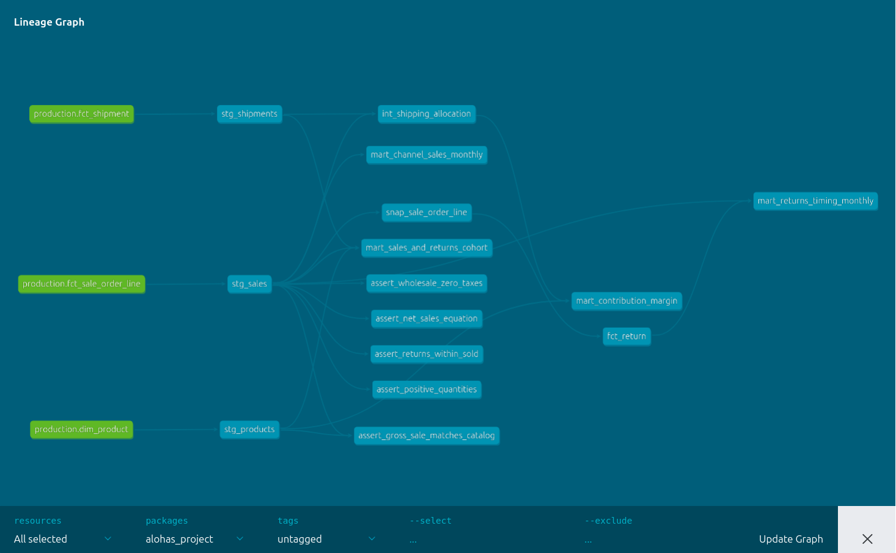

# ALOHAS — Analytics Engineer Study Case

Este repo responde tres preguntas de negocio para ALOHAS (canal, net sales con
devoluciones tardías, margen de contribución) **a través de un proyecto dbt
completo**: las preguntas no se contestan con queries sueltas, se contestan
construyendo capas — staging → intermediate → snapshot → marts — que se
puedan auditar, testear y reusar.

El reporte final es un HTML interactivo que **lee de esos marts**. La intención
es que el lector vea no solo *qué* respondemos, sino *cómo* llegamos ahí y *qué
asumimos en el camino*.

---

## El proyecto en una imagen



*Lineage generado por `dbt docs`: 3 sources (verde) → staging → intermediate +
snapshot → 5 marts. Los `assert_*` son los tests singulares que codifican las
reglas de negocio.*

---

## Cómo navegar el repo

```
.
├── data/                     CSVs sintéticos (extracto del dataset de BigQuery)
├── dbt/                      Proyecto dbt (el núcleo del caso)
│   ├── models/
│   │   ├── staging/          Limpieza + renombrado + sources + tests de origen
│   │   ├── intermediate/     int_shipping_allocation (prorrateo de envío)
│   │   └── marts/            Tablas finales que responden las 3 preguntas
│   ├── snapshots/            snap_sale_order_line (captura el dato mutable)
│   ├── tests/                Tests singulares (reglas de negocio)
│   └── macros/               generate_surrogate_key
├── notebooks/
│   ├── run_sql.ipynb         Auditoría de calidad de datos (working pre-modelado)
│   └── eda_and_insights.ipynb  Notebook exploratorio (queda como working)
├── report/
│   ├── build_report.py       Script Python: lee de los marts y arma el HTML
│   └── aloha_report.html     Reporte interactivo (abrir en navegador) ← EMPEZAR AQUÍ
└── analytics-engineer-case.pdf  El brief original
```

**Orden de lectura sugerido:** `report/aloha_report.html` (las conclusiones) →
este README (el proceso) → `dbt/models/` (la implementación).

---

## Cómo reproducirlo

Requiere Python 3.12. dbt corre sobre **DuckDB** leyendo los CSV de `data/` en
dev; el mismo proyecto apunta a **BigQuery** en el target `prod` (misma
definición de sources, dos engines).

```bash
python3 -m venv .venv && source .venv/bin/activate
pip install dbt-duckdb dbt-bigquery duckdb pandas plotly jupysql

# IMPORTANTE: dbt se ejecuta desde la RAÍZ del repo (las rutas a data/ y a la
# BD DuckDB son relativas a la raíz).
dbt build --project-dir dbt --profiles-dir dbt

# Regenerar el HTML (lee de los marts en alohas.db y escribe
# report/aloha_report.html — Plotly embebido, autocontenido, abre offline):
python3 report/build_report.py
```

`jupysql` solo lo necesitas si vas a re-ejecutar `notebooks/run_sql.ipynb`.
`alohas.db` y `dbt/target/` están en `.gitignore`: se recrean con `dbt build`.

---

## El proceso, paso a paso

### 1. Los datos que teníamos (3 sources)

Tres tablas crudas en `production`:

| Tabla                    | Granularidad   | Qué traía                                                       |
| ------------------------ | -------------- | ---------------------------------------------------------------- |
| `dim_product`            | 1 fila / SKU   | Nombre, categoría, precio de catálogo, **coste unitario**       |
| `fct_shipment`           | 1 fila / envío | Método de envío, coste, país de destino                          |
| `fct_sale_order_line`    | 1 fila / línea | Canal, SKU, shipment_id, qty vendida, qty devuelta, importes EUR |

**Lo que NO trae el dataset y debí asumir:**
- `fct_sale_order_line` **no tiene PK** — varias líneas pueden compartir todos
  los campos visibles. La construyo en staging (ver §3).
- `quantity_returned` **es mutable**: cuando llega la devolución (30-90 días
  después de la venta) se reescribe sobre la línea original, sin insertar fila
  nueva. No hay `return_date` en ningún sitio. Este es el problema central
  de la Pregunta 2.
- `dim_product` no tiene `weight_kg` → no se puede repartir el coste de envío
  por peso (la forma "correcta"). Esto fuerza el supuesto del prorrateo en §5.
- No hay `currency_code` ni `fx_rate`, pero el negocio envía a 8 países (ES,
  FR, DE, US, IT, UK, PT, MX). Todo viene pre-convertido a EUR aguas arriba.
  Imposible auditar el tipo de cambio aplicado.

### 2. Auditoría previa (antes de modelar nada)

Antes de tocar dbt corrí `notebooks/run_sql.ipynb` para entender el terreno.
Hallazgos que cambiaron decisiones de modelado:

- **Claves primarias** limpias en `dim_product` y `fct_shipment` (sin
  duplicados). En `fct_sale_order_line` simplemente no hay PK.
- **Integridad referencial rota**: ~750 líneas de venta con `sku` sin match
  en el catálogo (~203k€ de venta bruta, concentradas en Online) y ~500 sin
  envío. Total: 1.250 líneas huérfanas (~325k€). Esto fuerza la decisión
  por-pregunta de §5.
- **Consistencia financiera**: perfecta. `gross = base_price × qty`,
  `net = gross − taxes`, wholesale con impuestos en 0.
- **Límites físicos**: sin negativos, sin devoluciones > ventas.
- **Outliers de precio**: los altos son artículos premium reales (~400-550€),
  no errores de escala.

El reporte HTML abre con esta sección de auditoría: **40/40 tests, 0 errores,
1.250 huérfanos, 8 países sin moneda** — para que el lector vea la salud
de los datos antes que las conclusiones.

### 3. Staging — limpieza estable y cobertura de tests

Tres modelos uno-a-uno contra cada source:

- **`stg_products`**: renombra `sku` → `product_id`, castea precio y coste a
  `double`. PK `product_id` con `unique` + `not_null`.
- **`stg_shipments`**: renombra `country` → `destination_country_code`. PK
  `shipment_id` con `unique` + `not_null` y `accepted_values` en
  `shipping_method` (5 valores válidos del brief).
- **`stg_sales`**: el modelo más cargado. Aquí pasa lo importante:
  - **Construyo `sale_line_id`** hasheando los campos **inmutables** de la
    línea (`channel`, `sku`, `shipment_id`, `quantity_sold`, `gross_sale`,
    `created_at`). Excluyo `quantity_returned` justamente porque cambia
    — si lo incluyera, cada actualización generaría un `sale_line_id`
    distinto y el snapshot no podría seguir la misma línea en el tiempo.
  - Casteo `gross_sale`, `taxes`, `net_sales` a `double` y `created_at` a
    `timestamp`.
  - Las FK rotas (`product_id`, `shipment_id`) las declaro como tests
    `relationships` con `severity: warn` — documenta el problema sin
    bloquear el build.

El macro `generate_surrogate_key` (en `dbt/macros/`) hace md5 sobre la
concatenación de campos, con `to_hex()` en BigQuery para devolver string en
los dos engines. Equivalente ligero a `dbt_utils.generate_surrogate_key` sin
añadir el paquete.

### 4. Intermediate — `int_shipping_allocation`

El coste de envío vive a nivel de envío, pero el margen se calcula a nivel de
línea. Aquí prorrateo el `shipping_cost_eur` de cada envío entre sus líneas
según el % de `gross_sale_eur` que aporta cada una al total del envío.

¿Por qué un modelo intermediate y no inline en el mart?
- **Aísla la lógica del reparto** → el mart de margen se lee como una resta
  legible, no como una query de 80 líneas con window functions.
- **Testeable y reusable** → si mañana sale `weight_kg` en el catálogo,
  cambio solo este modelo.
- **Inner join con shipments aquí** → las líneas sin envío caen en esta capa
  (no hay coste de envío que repartir), exactamente donde tiene sentido.

### 5. Snapshot — capturar el dato mutable (`snap_sale_order_line`)

El problema: `quantity_returned` se actualiza in-place. Una métrica calculada
hoy sobre la tabla cruda "miente" mañana, retroactivamente.

La solución: `dbt snapshot` con estrategia `check` sobre `quantity_returned`.
Cada vez que se ejecuta, si el valor cambió para una línea, dbt cierra la
versión anterior (`dbt_valid_to`) y abre una nueva (`dbt_valid_from`). **Ese
`dbt_valid_from` es, en la práctica, la fecha en que detectamos la
devolución** — el dato que la tabla cruda no guarda.

Este snapshot es la pieza que habilita la Pregunta 2.

### 6. Marts — uno por propósito

Cinco marts. Cada uno tiene una granularidad explícita y una pregunta de negocio
detrás:

| Mart                              | Granularidad                | Pregunta que responde                                                 |
| --------------------------------- | --------------------------- | -------------------------------------------------------------------- |
| `mart_channel_sales_monthly`      | mes × canal                 | **P1**: ¿qué canal vende más / crece más?                              |
| `fct_return`                      | 1 fila por devolución       | Tabla de eventos: convierte el dato mutable en evento con `sale_date` + `return_date_est` |
| `mart_returns_timing_monthly`     | mes × canal                 | **P2**: net sales bajo las dos definiciones (as-of sale vs as-of report) lado a lado |
| `mart_sales_and_returns_cohort`   | cohorte de mes de venta × canal | **P2 auxiliar**: maduración de devoluciones por cohorte                |
| `mart_contribution_margin`        | canal × categoría           | **P3**: margen real después de coste de producto, envío y devolución   |

**Por qué `fct_return` existe** — la pregunta 2 necesita atribuir cada
devolución a *dos* fechas distintas (mes de la venta original vs mes en que
ocurre la devolución). Construir esto desde el snapshot y materializarlo como
**tabla de eventos** (un row por devolución) hace que los dos marts
descendientes sean queries simples de `group by`. La alternativa — calcular
ambas atribuciones directamente sobre el snapshot en cada mart — funciona,
pero duplica lógica y oscurece la granularidad.

**Por qué `mart_contribution_margin` agrupa canal × categoría** — el brief
pregunta "qué productos y qué canales ganan dinero". Bajar a `product_id` daba
tablas con miles de filas y ranking inestable; subir a solo canal escondía el
patrón Bags-Shoes-Accessories. Canal × categoría es la granularidad donde
los rankings se invierten (Bags cae del 3º al 5º al pasar de venta a margen
%), que es la observación que el reporte explota.

### 7. Tests — 40 nodos, 5 reglas singulares

`dbt build` corre 40 nodos. Cobertura:
- **Schema tests**: `unique` / `not_null` en PKs, `relationships` en FKs (warn
  para los huérfanos conocidos), `accepted_values` en `channel` y
  `shipping_method`.
- **5 tests singulares** que codifican reglas de negocio:
  - `assert_net_sales_equation` — `net = gross − taxes`
  - `assert_wholesale_zero_taxes` — wholesale nunca lleva impuestos
  - `assert_gross_sale_matches_catalog` — `gross = base_price × qty`
  - `assert_returns_within_sold` — `quantity_returned ≤ quantity_sold`
  - `assert_positive_quantities` — sin negativos

---

## Supuestos clave (resumen accionable)

**Líneas huérfanas — decisión por pregunta, no global.**
- En **ventas por canal** (P1) las **conservo**: solo necesito canal + fecha +
  importe, y las huérfanas los tienen. Excluirlas escondía ~230k€ reales.
- En **margen de contribución** (P3) las **descarto** (inner join): sin coste
  de producto/envío no hay margen que calcular.

**Devoluciones — fecha estimada vs real.** En este CSV sintético
`quantity_returned` ya viene en su valor final, así que `fct_return` estima la
`return_date` como `sale_date + 60 días` (punto medio de la ventana 30-90).
En producción se reemplaza por el `dbt_valid_from` real del snapshot. Lo que
el modelo demuestra es la **mecánica** y la **diferencia de atribución
temporal**, no la maduración real.

**Envío — prorrateo por venta bruta.** Sin `weight_kg`, reparto el coste de
envío proporcional al `gross_sale` de cada línea dentro del envío. Es opinable
— un bolso de 400€ asume más coste de envío que algo de 30€ aunque pese
parecido. El reporte muestra esta decisión en un disclosure colapsable junto
al supuesto.

**Devoluciones — destino del stock.** Asumo que la unidad devuelta **se
reincorpora al stock**: no pierdo su coste de producto, solo descuento las
unidades netas.

**Coste de devolución — 8,00€ por unidad devuelta** (recibir, inspeccionar,
re-empacar). Es el supuesto más opinable. A 15€/u, Online baja ~1 pp;
Wholesale apenas se mueve (devuelve solo el 4%).

**Multi-país sin moneda.** Gap de **modelado**, no de datos. Hoy es imposible
auditar el tipo de cambio aplicado ni separar pérdida cambiaria del margen
real. Flageado en la sección de auditoría del reporte.

---

## Las tres preguntas, en corto

0. **Auditoría primero.** 1.250 líneas con FK rota (~325k€ de venta bruta) que
   conservo en P1 y excluyo en P3. 8 países sin columna de moneda.
1. **Canal.** Online concentra el 56% de la venta neta (5,1M€ de 9,1M€) con
   crecimiento de +18% interanual. Los cuatro canales crecen en banda estrecha:
   motor ancho, no dependencia de uno solo. Toggle CEO / cohorte para mostrar
   cuándo cuenta la devolución.
2. **Net sales con devoluciones tardías.** Snapshot SCD-2 → `fct_return` →
   mart con las dos métricas lado a lado. Defiendo *as-of report date* para
   reporting financiero (no reescribe el pasado) y *as-of date of sale* para
   análisis de cohorte.
3. **Margen de contribución.** Online aporta más margen absoluto (2,1M€) pero
   Wholesale gana en eficiencia (55,5% vs 42,6%). El ranking se da la vuelta
   también en categorías: Bags cae del 3º al 5º al pasar de venta a margen %;
   Shoes salta al 1º.

---

## Qué haría con más tiempo

- **Catálogo enriquecido:** añadir `weight_kg` y `currency_code` a
  `dim_product` y a la granularidad de venta. Son los dos gaps que más limitan la
  fidelidad del cálculo de margen y el análisis multi-país.
- **Snapshots con historia real:** correr el snapshot sobre varios cortes
  para que `fct_return` use fechas de devolución reales en vez del supuesto
  de +60 días.
- **Sensibilidad del coste de devolución:** sacar el 8,00€ a una variable
  `dbt` (`vars:`) y exponer un slider en el reporte para ver el rango de
  margen por canal/categoría en tiempo real.
- **Investigar los SKU huérfanos:** ¿son catálogo incompleto (modelado) o
  basura (datos)? Hoy solo los aíslo.
- **Exposures de dbt + CI** que corra `dbt build` en cada push.
